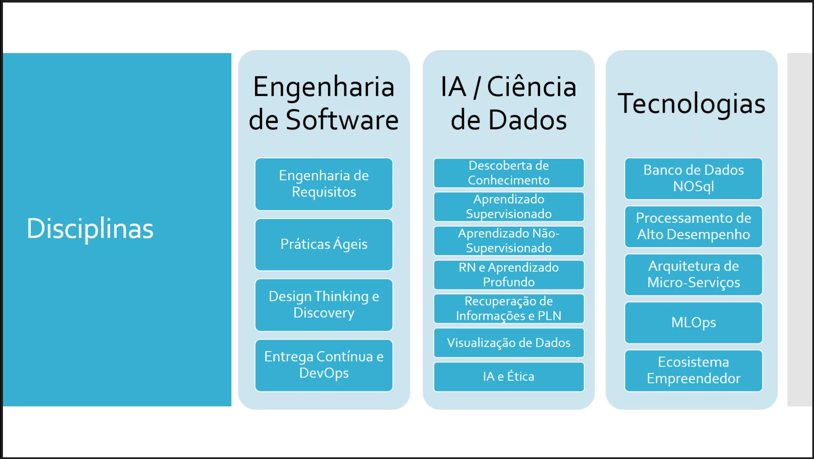
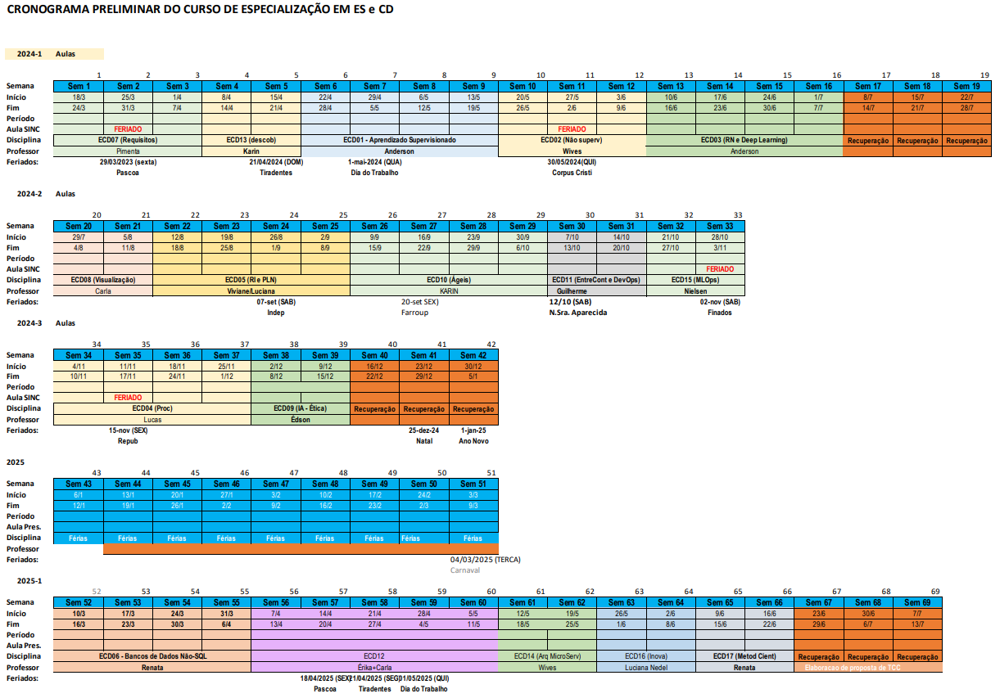
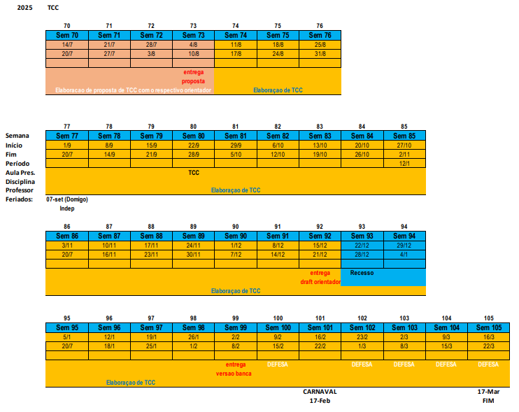

# ESCD

These are my notes for the Software Engineering for Data Science Applications course at UFRGS (Universidade Federal do Rio Grande do Sul).

Official name: **Especialização em Engenharia de Software para Aplicações de Ciência de Dados**

## Coordinators

Karin Becker
Marcelo Soares Pimenta

## Schedule

360 hours, 17 courses - 10 of which have 15h, 7 that have 30h

Synchronous, recorded classes (at least 80%)

Asynchronous (up to 20%) with deadlines

## First Module

Online classes on

- Every Tuesday (19:30 to 21:30)
- Every Thursday (19:30 to 21:30)
- Every *other* Saturday (8:30 to 12:00)

No classes on holidays

## Links

- [**MS Teams**](https://teams.microsoft.com) for sync classes and async comms with professors and assistants (monitores)
- [**MOODLE**](https://moodle.ufrgs.br) for academic content and material
- [**UFRGS Portal**](https://ufrgs.br) for management

## Goals

Abilities and updates in the integration of DS and SWE

## Disciplines

**"General Information"** discipline available on `Moodle` (ECD00)

Also used as communication channel

There is also library access there

## TCC (Course Conclusion Work)

Oriented by a professor

Preferably with an application on professional activities of the student

## Frequency

At least 75% of presence in synchronous classes

Any impediment can be informed to teacher

## Email

[Academic and administrative email](eng-sw-ciencia-dados@inf.ufrgs.br)
[Financial](financeiroprojetos@feeng.com.br)
